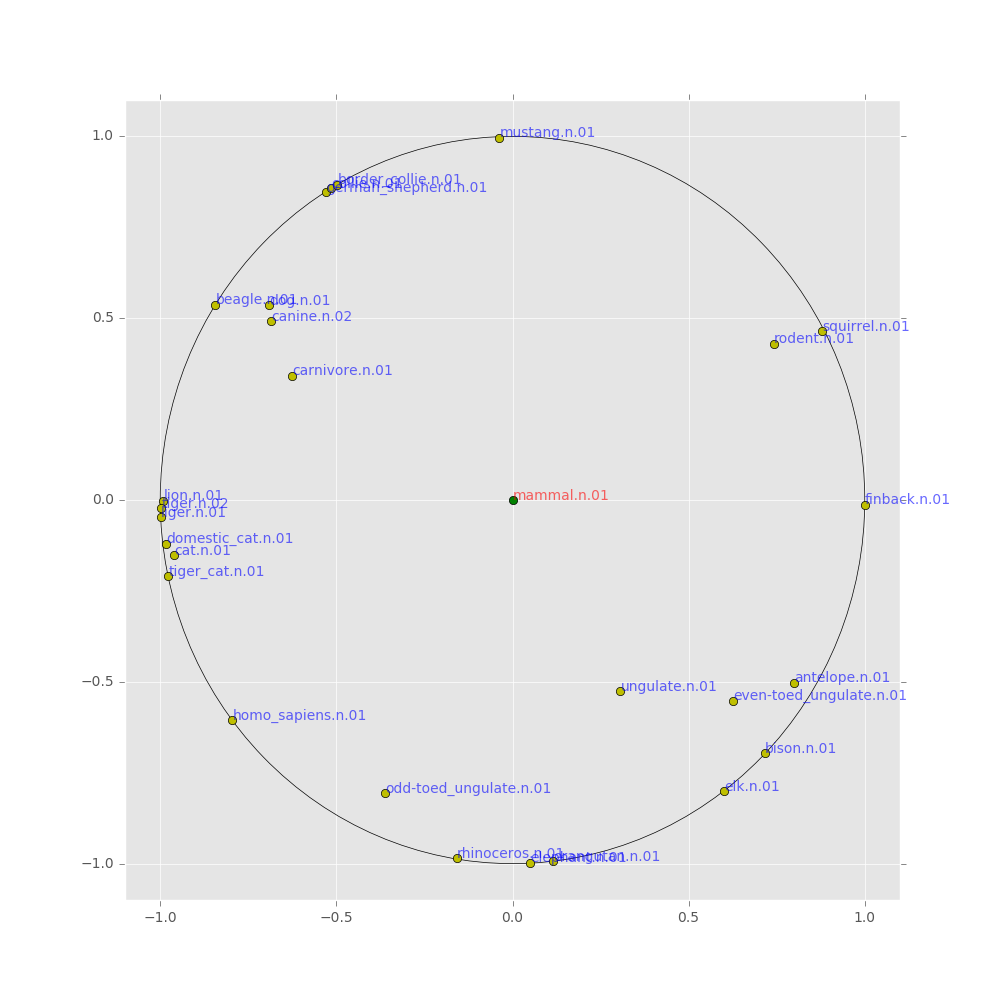

# poincare-embedding

These codes implement Poincar\'e Embedding introduced in the following paper:

[Maximilian Nickel and Douwe Kiela, "Poincar\'e Embeddings for Learning Hierarchical Representations'", arXiv preprint arXiv:1705.08039, 2017.](https://arxiv.org/abs/1705.08039)

## Requirements

- C++ compiler that supports c++14 or later
    - for Windows user, using cygwin is recommended (with CMAKE and gcc/g++ selection) (thanks @patrickgitacc)

## Build

```shell
cd poincare-embedding
mkdir work & cd work
cmake ..
make
```

## Tutorial

We assume that you are in work directory


```shell
cd poincare-embedding
mkdir work & cd work
```

### Data Creation

You can create WordNet noun hypernym pairs as follows

```shell
python ../scripts/create_wordnet_noun_hierarchy.py ./wordnet_noun_hypernyms.tsv
```

and mammal subtree is created by

```shell
python ../scripts/create_mammal_subtree.py ./mammal_subtree.tsv
```

### Run

```shell
./poincare_embedding ./mammal_subtree.tsv ./embeddings.tsv -d 2 -t 8 -e 1000 -l 0.1 -L 0.0001 -n 20 -s 0
```
### Plot a Mammal Tree

```shell
python ../scripts/plot_mammal_subtree.py ./embeddings.tsv --center_mammal
```



